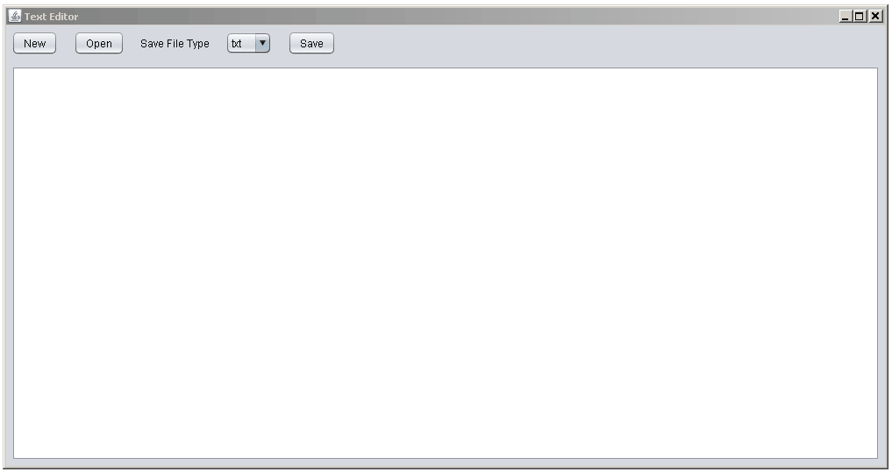

# SimpleTextEditor (STE)
## Overview

Built with Java Swing, STE is a tool which provides basic  text editing features including:

1. Opening, saving and editing text documents
 
2. Responsive spell checking implemented using JOrtho (it does not check punctuation)
 
3. Support for commonly used text file formats  such as ".doc", ".rtf" and ".txt". 

### Demo

## Dependencies

Java version: 8

Platform: Windows

Third party libraries: JOrtho 

## Documentation

JOrtho: http://jortho.sourceforge.net/
